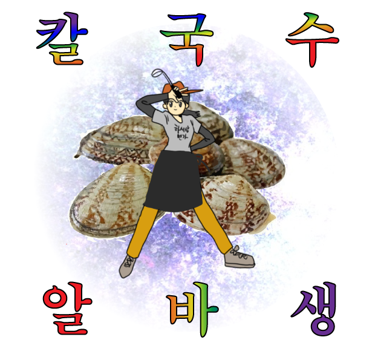
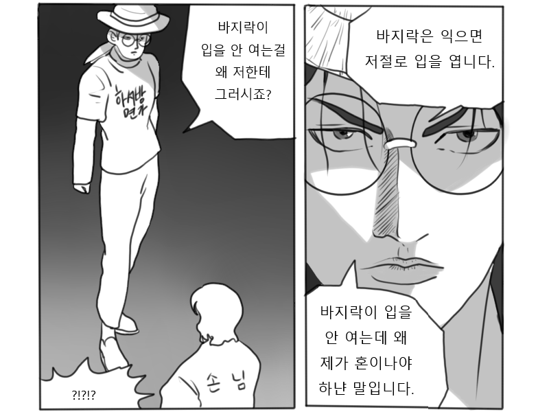

# First_Step
<html>
<head>
    <title>임하의 방학은!?</title>
</head>
<body>
     <h1>내 방학은 바지락이었네</h1>

    
저는 이제 자취를 시작하게 되어서, 조금이나마 도움이 되고자 알바를 시작했습니다. 음식점 알바는 인생에서 처음이었기에, 걱정반 설렘반으로 시작했습니다. 나는야 칼국수 알바생

    
   &nbsp;
    <h2>돈과 제 정신의 건강을 바꾸었습니다.</h2>
    
인내심도 기르고 자본주의에 굴복하는 방학을 보냈습니다. 결국 그 스트레스를 풀려고 피시방에 가서 하루종일 오버워치를 해버렸고... 
 
알바하면서 좋았던 점은 밥이 맛있었습니다. 
    그리고 방학 내내 자취방을 알아보고 가구를 구하고, 바쁘지도 한가하지도 않게 보냈습니다.

    

그래도 친절한 손님들도 많았습니다. 고생하는 딸이나 아들이 생각난다며 팁으로 2만원 주신 손님분... 정말 감사합니다. 적게 일하고 많이 버십시오.

